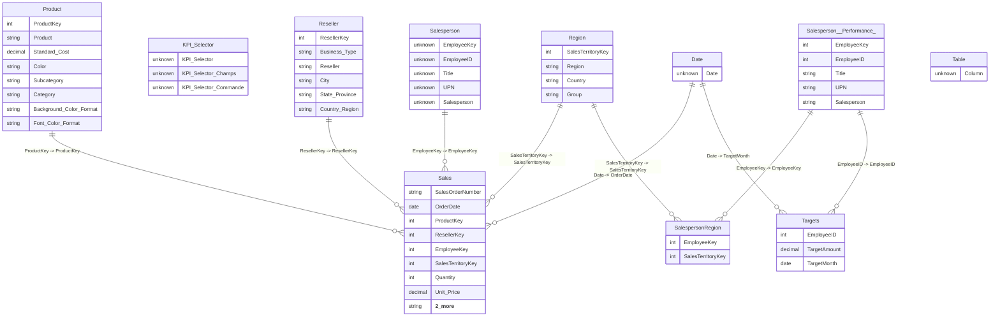
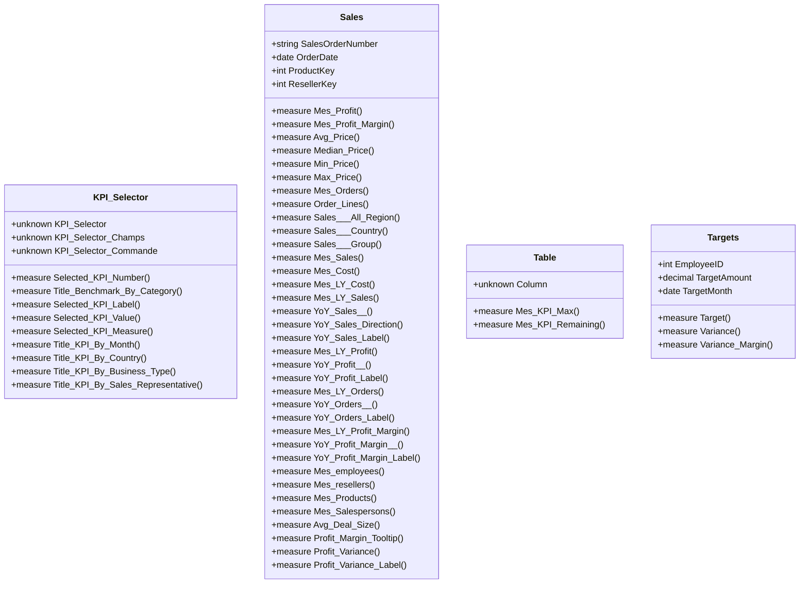

<!-- filepath: C:\Users\ukengne\Desktop\Trainings\Github\MonProjet-PowerBI\docs\model-diagram.md -->
# Documentation du Modèle — SalesAnalysis

> 🤖 Fichier généré automatiquement par `scripts/generate_mermaid.py`.
> Ne pas modifier manuellement — toute modification sera écrasée.

## Statistiques

| Élément | Nombre |
| --- | --- |
| Tables | 11 |
| Relations | 9 |
| Colonnes | 48 |
| Mesures DAX | 49 |

## Schéma en étoile (erDiagram)

## Architecture du modèle (flowchart)

```mermaid
flowchart TD
    subgraph Dims["Dimensions"]
        Date["Date
1 colonnes"]
        Product["Product
8 colonnes"]
        Region["Region
4 colonnes"]
        Reseller["Reseller
6 colonnes"]
        Salesperson__Performance_["Salesperson (Performance)
5 colonnes"]
        Salesperson["Salesperson
5 colonnes"]
        SalespersonRegion["SalespersonRegion
2 colonnes"]
    end
    subgraph Facts["Tables de Faits"]
        KPI_Selector[/"KPI Selector
9 mesures"/]
        Sales[/"Sales
35 mesures"/]
        Table[/"Table
2 mesures"/]
        Targets[/"Targets
3 mesures"/]
    end
    Product -->|ProductKey| Sales
    Region -->|SalesTerritoryKey| Sales
    Reseller -->|ResellerKey| Sales
    Salesperson__Performance_ -->|EmployeeKey| SalespersonRegion
    Region -->|SalesTerritoryKey| SalespersonRegion
    Salesperson__Performance_ -->|EmployeeID| Targets
    Salesperson -->|EmployeeKey| Sales
    Date -->|Date| Sales
    Date -->|Date| Targets
    style KPI_Selector fill:#FAEEDA,stroke:#854F0B
    style Sales fill:#FAEEDA,stroke:#854F0B
    style Table fill:#FAEEDA,stroke:#854F0B
    style Targets fill:#FAEEDA,stroke:#854F0B
    style Date fill:#EBF3FB,stroke:#185FA5
    style Product fill:#EBF3FB,stroke:#185FA5
    style Region fill:#EBF3FB,stroke:#185FA5
    style Reseller fill:#EBF3FB,stroke:#185FA5
    style Salesperson__Performance_ fill:#EBF3FB,stroke:#185FA5
    style Salesperson fill:#EBF3FB,stroke:#185FA5
    style SalespersonRegion fill:#EBF3FB,stroke:#185FA5
    style Facts fill:#FBF5E4,stroke:#C9A84C
    style Dims fill:#E8F0FB,stroke:#1B4F8A
```

## Catalogue des mesures DAX (classDiagram)

